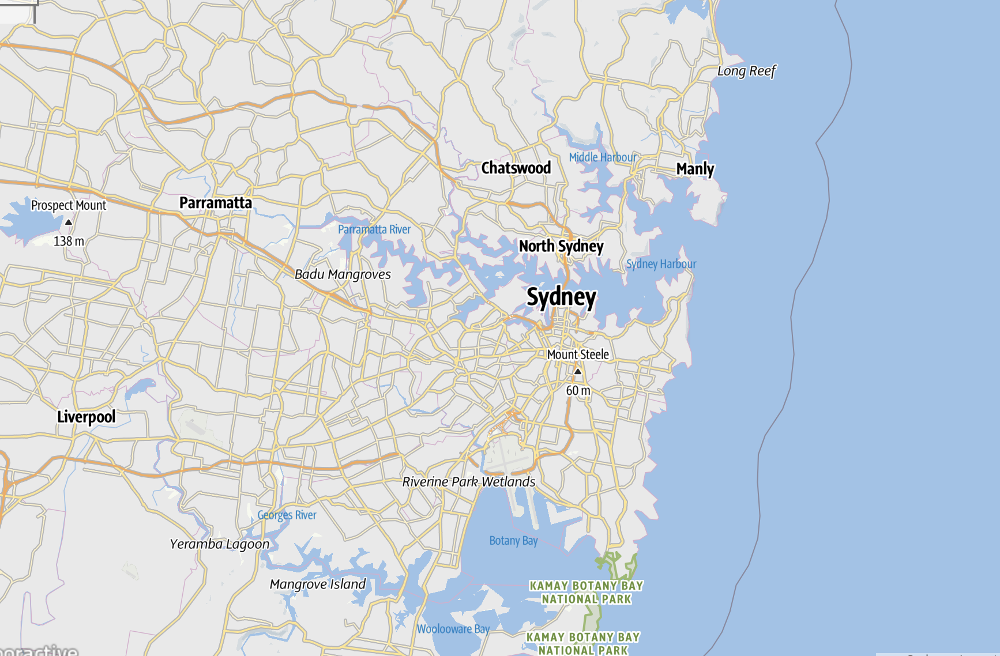

# Project-1-GB

##Description

We have created an application that will, based on a inputed location, tell the user the weather forecast (7 day forecast). It will also bring up a map of the area searched for a fixed radius and a list of avilable hiking trails, if there are any in the searched radius. If no hiking trails are found within the searched radius the user is prompted to zoom out on the map to increase the search radius. The user can then click on a hiking trail to get more information about it.

##Installation

No installation needed. The code is deployed as a stand alone page on Git Pages, (https://troy-earle.github.io/Project-1-GB/)

##Usage

From the landing page, the user is met with a seach bar

 in which they are prompted to enter a city name. Once the user clicks the search button, the are brought to a page that will display a 7 day forecast for the location searched,
 
 
 
 a map of the area,
 
 

 and a list of hiking trails for the same area (if there are any). The user can then click on a hiking trail to get more information about it.
 
 
 
If no hiking trails exist in the searched radius the user is prompted to zoom out on the map to expand the search area.

On the header the user will see  a button to return to the home page

 and an infotmation button
 
 
 
that will bring the user to About Us page.

##Credit

Logo created with https://smashinglogo.com/

Weather API https://open-meteo.com/

Trails API https://www.outdooractive.com/en/

Geocoding API https://opencagedata.com/

Project compelted by Karra Ormsby, Troy Earle, and Alexander Chrystall
